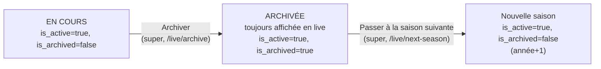

# Architecture — PST 2026

> Document technique décrivant l'architecture réelle du code tel qu'il existe dans le dépôt. Pour le langage visuel (couleurs, typo, composants UI), voir [`design-system.md`](./design-system.md).

---

## 1. Vue d'ensemble

PST 2026 est une application web privée de gestion de tournoi de pétanque (classement ELO, suivi live, archives, vidéos) construite avec :

| Domaine | Techno |
|---|---|
| Framework | **Next.js 16** (App Router, Server + Client Components) |
| UI | **React 19**, Tailwind CSS v4, Lucide Icons |
| Backend / DB | **Supabase** (PostgreSQL + Auth + Storage + Realtime) |
| Graphiques | Recharts |
| 3D | Three.js / React Three Fiber (`@react-three/fiber`, `@react-three/drei`) |
| Langage | TypeScript |
| Déploiement cible | Vercel |

> ⚠️ **Next.js 16** introduit des changements par rapport aux versions antérieures (voir `AGENTS.md` à la racine : la doc locale à jour se trouve dans `node_modules/next/dist/docs/`). Le fichier middleware s'appelle ici `proxy.ts` (export `proxy`), pas `middleware.ts`.

---

## 2. Arborescence applicative (App Router)

```
app/
├── layout.tsx                     Layout racine : <Navbar/> + <main/> + <Footer/>
├── page.tsx                       Accueil (hero, compteur joueurs, accès rapide) — bandeau
│                                    "live" remplacé par l'annonce des vainqueurs (photos, score)
│                                    tant que la saison active est archivée sans saison suivante
│                                    démarrée, voir §12
├── globals.css                    Thème Tailwind v4 (@theme, couleurs de base)
├── manifest.ts                    PWA manifest
│
├── (acces)/                       Groupe de routes — authentification
│   ├── login/page.tsx
│   ├── signup/page.tsx             (code d'invitation requis, RPC verify_invitation_code)
│   ├── reset-password/page.tsx     Reset mdp des comptes pseudo (@pst.net), voir §4d
│   └── logout/page.tsx
│
├── auth/callback/route.ts         Callback OAuth/Magic Link Supabase
│
├── (sections)/                    Groupe de routes — contenu public "vitrine"
│   ├── about/page.tsx              L'esprit du tournoi
│   ├── concept/page.tsx            Règlement officiel (poules, tirage, fondateurs)
│   ├── regles-elo/page.tsx         Explication pédagogique des 2 algorithmes ELO
│   ├── classement/page.tsx         Leaderboard ELO (Classic + Modern)
│   ├── classement/progression/page.tsx   Courbe de progression multi-joueurs
│   ├── stats/page.tsx              Tableaux de bord (Recharts) : global/scores/joueurs/
│   │                                records/évolution/popularité (RPC get_popularity_stats)
│   ├── tournois/page.tsx           Liste des éditions passées
│   ├── tournois/[year]/page.tsx    Détail d'une édition (poules, finales, résultats)
│   ├── videos/page.tsx             Hub "Médiathèque" (3 pavés : Vidéos/Photos/Contribuez)
│   ├── videos/gallery/page.tsx     Galerie YouTube + remerciements (contenu d'origine)
│   ├── videos/photos/page.tsx      Galerie photo (vignettes signées, clic → version complète)
│   ├── videos/upload/page.tsx      Import photo (compression + conversion WebP côté client)
│   ├── share/page.tsx              Plein écran QR code d'invitation
│   └── render/                     3D de la résidence, voir §9
│       ├── page.tsx                 Maquette 3D publique
│       ├── documents/               Lecture seule, palier ≥ 1 (layout.tsx = garde)
│       ├── codes/                   Lecture seule, palier ≥ 1 (layout.tsx = garde)
│       ├── contacts/                Lecture seule, palier ≥ 2 (layout.tsx = garde)
│       ├── lots/                    Fiches signalétiques Bâtiment B, lecture seule, palier ≥ 2 (layout.tsx = garde)
│       └── prive/                   Gestion CRUD (rôle super uniquement), voir §9
│           ├── layout.tsx            Garde d'accès via RPC is_super()
│           ├── page.tsx              Hub (Contacts / Documents / Codes)
│           ├── contacts/page.tsx     CRUD résidence_contacts (Conseil Syndical, gardien, copro, locataire, fournisseur)
│           ├── documents/page.tsx    CRUD résidence_documents (liens Google Drive, catégorie, résumé markdown)
│           └── codes/page.tsx        CRUD résidence_codes (portails, digicodes)
│
├── joueurs/[id]/page.tsx          Fiche joueur (Server Component, profil ELO complet)
│
├── live/                          Espace tournoi "en cours"
│   ├── page.tsx                    Vue publique du direct
│   ├── switch/page.tsx             Sélecteur d'accès rapide (admin/super)
│   ├── progression/page.tsx
│   ├── (admin)/                    Groupe protégé : rôle admin OU super
│   │   ├── layout.tsx               Garde d'accès via RPC get_my_role()
│   │   ├── admin/page.tsx           Panel de pilotage du tournoi — choix du format (classique/10_equipes/ronde)
│   │   ├── poules/page.tsx          Saisie des scores de poules (classique/10_equipes)
│   │   ├── ronde/page.tsx           Saisie ronde par ronde, système suisse (format ronde), voir §7
│   │   ├── demi/page.tsx            Saisie des demi-finales (format classique uniquement)
│   │   ├── finale/page.tsx          Saisie des finales (les 3 formats, réutilisée telle quelle pour ronde)
│   │   └── podium/page.tsx          Palmarès final (classement, historique, graph)
│   └── (super)/                    Groupe protégé : rôle super uniquement
│       ├── layout.tsx               Garde d'accès via RPC is_super()
│       ├── super/page.tsx           Panel super admin (maintenance, navigation, codes d'accès résidence en tête de page)
│       ├── users/page.tsx           Gestion des comptes (site_users)
│       ├── admin_joueurs/page.tsx   CRUD joueurs (profiles)
│       ├── admin_teams/page.tsx     CRUD équipes / doublettes
│       ├── params_elo/page.tsx      Réglages du moteur ELO (table settings)
│       ├── reset/page.tsx           Reset du tournoi live
│       ├── charte/page.tsx          Visionneuse de charte.md (via /api/dev/charte)
│       ├── todo/page.tsx            Visionneuse de todo.md (via /api/dev/todo)
│       ├── activity/page.tsx        Journal d'activité (filtrable par section du site)
│       ├── online/page.tsx          "Qui est en ligne" (activité < 1h, auto-refresh 15s)
│       ├── archive/page.tsx         Archivage de la saison live vers teams/games (voir §12)
│       ├── next-season/page.tsx     Passage à la saison suivante + reset (voir §12)
│       ├── screen/page.tsx          Écran "composition des équipes" partageable (fond blanc)
│       └── screen-podium/page.tsx   Écran "résultats" partageable (fond blanc), voir §6
│
└── api/
    ├── admin/recompute-elo/route.ts   Recalcul complet de l'historique ELO (toutes saisons, 3 méthodes)
    ├── admin/live-elo/route.ts        Recalcul de l'historique ELO du tournoi live en cours (3 méthodes)
    ├── admin/backup-tournament-data/route.ts  Export JSON tournoi+historique, réservé super (voir §12)
    ├── auth/reset-password/route.ts   Reset mdp comptes pseudo (client service-role), voir §4d
    └── dev/charte/, dev/todo/route.ts Lecture de fichiers .md locaux (debug/admin)
```

**Route groups** : `(acces)` et `(sections)` n'affectent pas l'URL — ils servent uniquement à organiser le code. `(admin)` et `(super)` dans `live/` fonctionnent pareil côté routing, mais chacun porte un `layout.tsx` qui agit comme **garde d'accès** (voir §4).

---

## 3. Composants partagés (`/components`)

| Composant | Rôle |
|---|---|
| `Navbar.tsx` | Nav sticky, détecte le rôle (`membre`/`admin`/`super`) via `supabase.rpc('get_my_role')`, affiche icônes et accès contextuels, écoute `onAuthStateChange` |
| `Footer.tsx` | Version de build (`APP_VERSION` + SHA Vercel), lien QR (`/share`) |
| `EloChart.tsx` | Courbe ELO d'un joueur (Recharts), bascule Classic/Modern/Dynamique (rouge/violet/émeraude), marqueurs par saison. Tooltip Dynamique en décimales virgule FR (échelle resserrée, un écart de 0,6 point est significatif) plutôt qu'entier comme les deux autres |
| `GlobalProgressionChart.tsx` | Courbe multi-joueurs (jusqu'à ~31 lignes colorées en HSL), toggle Classic/Modern/Dynamique (pilote à la fois le tracé des lignes et le tri du Top 16 affiché dans le tooltip — le RPC renvoie les joueurs triés par Classic, retrié côté client selon la méthode active), tooltip Top 16 |
| `SeasonHistory.tsx` | Accordéon historique saison par saison avec détail des matchs |
| `StatsCard.tsx` | Tuile de statistique générique (label/valeur/couleur) |
| `Stepper.tsx` (`RenderStepper`) | Frise de progression du tournoi, liste d'étapes pilotée par le prop `format` : `classique` (6 étapes, avec Demis), `10_equipes` (5, sans Demis), `ronde` (5, "Rondes" puis "Finales" au lieu de "Poules"/"Demis") |
| `PouleStandingsTable.tsx` | Tableau de classement de poule partagé (Rk/Équipe/J/V-D-N/Pour-Contre/Diff/Pts), réutilisé par `poules`/`finale`/`podium`/`live`/`tournois/[year]` via `utils/live-stats.ts#calculatePouleStandings` — un seul calcul/rendu au lieu de versions "mini" divergentes. Sur mobile, V/D/N et P/C sont fusionnés en une seule colonne empilée sur 2 lignes (la ligne fait déjà 3 lignes de haut à cause du nom pointeur/tireur) plutôt que masqués ; Diff/Pts en padding réduit pour laisser la place |
| `LiveDraftDraw.tsx` | Tirage des équipes "en direct" (`admin/page.tsx`, étape EQUIPES, `live_tournament.team_mode = 'live'`) : révèle les joueurs par paire en cliquant sur celui annoncé (aucune randomisation côté app), mode "Présélection P/T" (respecte les pools JOUEURS) ou "Rôles aléatoires" (pool unique, rôle alterné par position de tirage) |
| `FavoriStar.tsx` | Étoile affichée à côté du nom d'un joueur quand c'est le favori de l'utilisateur courant (`utils/favori.ts` côté serveur, `hooks/useFavoriId.ts` côté client) |
| `FavoriteButton.tsx` | Toggle "joueur favori" (Client Component isolé pour préserver le Server Component parent) |
| `MarkdownDisplay.tsx` | Rendu stylisé de contenu Markdown (react-markdown + typography PST) |
| `GlobalLoadingBar.tsx` | Barre rouge fine en haut de l'écran, pilotée par un compteur incrémenté/décrémenté via un `fetch` custom posé sur le client Supabase navigateur (`utils/supabase/client.ts`) — s'affiche automatiquement pendant toute requête, sans instrumenter chaque appel |
| `PageViewTracker.tsx` | Composant invisible monté dans `layout.tsx`, logue un `PAGE_VIEW` à chaque changement de route (`usePathname`/`useSearchParams`) |
| `PredictionModal.tsx` | Moteur de "prono IA" (probabiliste), voir §8. Variantes historiques (`-bayer`, `-cp1`, `-cp2`) supprimées (dead code confirmé, cf. `todo.md`) |
| `Logo.tsx` | Logo SVG (tour + boule + cochonnet). `Logo_anc.tsx` (version antérieure) supprimé (dead code confirmé) |

---

## 4. Authentification & autorisation

Deux couches complémentaires :

### a) `proxy.ts` (middleware Next.js 16)
- Ignore les assets statiques et `/api/*`.
- Rafraîchit la session Supabase via `@supabase/ssr` (cookies).
- Redirige vers `/login` tout visiteur non authentifié sur une route non publique (`publicRoutes = ['/', '/login', '/signup', '/auth/callback']`).

### b) Garde de rôle par `layout.tsx`
Chaque zone sensible embarque son propre layout serveur qui interroge des fonctions RPC Postgres :

```mermaid
flowchart TD
    A[Requête] --> B{proxy.ts}
    B -- non connecté --> L[/login]
    B -- connecté --> C[Route demandée]
    C --> D{Dans live/(admin) ?}
    D -- oui --> E["rpc get_my_role()"]
    E -- role ∉ [admin, super] --> R1[/live]
    E -- ok --> F[Page admin]
    C --> G{Dans live/(super) ?}
    G -- oui --> H["rpc is_super()"]
    H -- false --> R2[/]
    H -- true --> I[Page super]
```

**Rôles** : `membre` (défaut après inscription) < `admin` < `super`. Le rôle est stocké côté `site_users` et exposé via les RPC `get_my_role()` / `is_super()` (contournent RLS pour la lecture du rôle courant). L'inscription email/mot de passe est protégée par un code d'invitation vérifié via le RPC `verify_invitation_code` (table `site_config`).

### c) Inscription Google OAuth — vérification serveur du code d'invitation
`proxy.ts` ne peut pas intervenir sur ce cas précis : au moment où il intercepte la requête `/auth/callback?code=...`, le compte Google n'existe pas encore (il est créé *pendant* l'exécution du Route Handler par `exchangeCodeForSession`). La protection vit donc entièrement dans `app/auth/callback/route.ts` :
1. Échange le code Google contre une session.
2. Détecte un tout premier login (`created_at === last_sign_in_at`, identiques uniquement à la création du compte).
3. Si c'est un nouveau compte, revérifie le code d'invitation **côté serveur** via un client `SUPABASE_SERVICE_ROLE_KEY` (le code est transmis dans l'URL de retour `redirectTo`, pas via `localStorage` qui n'est pas lisible par un Route Handler).
4. Code absent/invalide → le compte est supprimé (`site_users`, `session_logs`, `activity_logs` nettoyés manuellement avant `auth.admin.deleteUser`, en plus des `ON DELETE CASCADE` déjà en place côté ces tables — double sécurité si une future table référence `auth.users` sans cascade), la session est révoquée, redirection vers `/signup?error=invite_required`.

Le bouton Google de `/login` (qui ne transmet aucun code) est protégé par la même logique : toute création de compte qui y transiterait est rejetée exactement comme via `/signup`.

### d) Réinitialisation de mot de passe (comptes pseudo uniquement)
Les comptes créés via `/signup` (hors Google) utilisent un email **synthétique** `${nickname}@pst.net` — pas de vraie boîte mail, donc le flux Supabase standard (`resetPasswordForEmail`, lien par email) est inutilisable. `/reset-password` + `app/api/auth/reset-password/route.ts` proposent une alternative : le formulaire demande pseudo + code d'invitation + nouveau mot de passe ; la route (client `SUPABASE_SERVICE_ROLE_KEY`) revérifie le code via le même RPC `verify_invitation_code`, retrouve l'utilisateur via l'email déterministe (`auth.admin.listUsers` puis recherche par email — pas de filtre serveur disponible sur ce SDK, un seul appel large suffit vu la taille du club), et appelle `auth.admin.updateUserById`. Erreur générique commune (code invalide *ou* pseudo introuvable) pour ne pas laisser deviner les pseudos existants. Action tracée dans `session_logs` (`PASSWORD_RESET`).

> ⚠️ **Le code d'invitation est un secret unique partagé par tous les membres.** L'utiliser comme seule vérification de reset signifie que n'importe quel membre le connaissant peut réinitialiser le mot de passe d'un autre membre s'il connaît son pseudo (contrairement à l'inscription, où le code n'autorise qu'à créer un compte pour soi-même). Risque documenté et accepté vu le contexte (club fermé) — voir `todo.md` (section Sécurité).

### e) Palier d'accès résidence (`site_users.residence_access_level`)

Axe d'autorisation **indépendant du rôle global**, dédié à l'espace résidence (§9) : `role` régit le concours (membre < admin < super), `residence_access_level` régit ce qu'un `membre`/`admin` peut consulter côté résidence, sans jamais toucher au CRUD (toujours exclusivement `super`).

- `0` — aucun accès résidence (défaut)
- `1` — **Consultation** : documents (liste + lien Drive) et codes d'accès
- `2` — **Avancé** : tout le niveau 1 + résumés markdown des documents + contacts
- Un `role = 'super'` a toujours accès total, indépendamment de sa valeur de `residence_access_level` (généralement laissée à `0`, non pertinente pour ce rôle)

RPC `get_residence_access_level()` (`SECURITY DEFINER`, même principe que `is_super()`) : contourne le RLS de `site_users` pour exposer uniquement le palier de l'utilisateur courant. Utilisée à la fois dans les policies RLS des 3 tables résidence et côté client (`hooks/useResidenceAccessLevel.ts`, calqué sur `hooks/useIsSuper.ts`) pour l'affichage conditionnel des boutons/pages. Gate serveur factorisée dans `lib/residence-access.ts#hasResidenceAccess(minLevel)`, appelée par les `layout.tsx` de `render/documents/`, `render/contacts/`, `render/codes/` (redirect `/render` si palier insuffisant — même schéma que `render/prive/layout.tsx` pour `is_super()`).

Géré depuis `/live/users` (super), colonne "Accès Résidence" à côté du rôle.

---

## 5. Modèle de données (Supabase / PostgreSQL)

Aucun fichier de schéma SQL n'est versionné dans le dépôt — le schéma ci-dessous est **reconstruit par lecture du code** (requêtes `.from(...)`). À vérifier/exporter depuis le dashboard Supabase si un schéma faisant autorité est nécessaire.

### Identité & comptes
- **`profiles`** — fiche joueur : `id`, `nom`, `photo_url`, `level`, relation `elo_history`
- **`site_users`** — compte applicatif : `id` (= auth uid), `role` (`membre`/`admin`/`super`), `favoris` (FK → `profiles.id`), `residence_access_level` (`0`/`1`/`2`, voir §4e — indépendant du rôle)
- **`site_config`** — clé/valeur (ex. `invitation_code`)
- **`session_logs`** — journal des connexions/déconnexions

### Historique (saisons archivées)
- **`seasons`** — `year`, `is_active` (une seule ligne à la fois, garanti par le cycle décrit en §12), `format` (`classique`/`10_equipes`/`ronde`, renseigné à l'archivage), `is_archived` (indépendant de `is_active` — voir §12 pour le cycle de vie complet)
- **`teams`** — doublette d'une saison passée : `tireur_id`, `pointeur_id`. `id` auto-incrémenté ; ne pas confondre avec `live_teams.id` qui est une lettre (voir §12)
- **`games`** — match archivé : `team_1_id`, `team_2_id`, `score_1`, `score_2`, `type` (`Poule`/`Demi`/`Finale`/`Finale RangN` selon le format), `year`, `poule` (`Gassin`/`Ramatuelle`/`Ronde`), `tableau`
- **`elo_history`** — un enregistrement par joueur par match, **3 méthodes de classement en parallèle** (voir §6) : `elo_value`/`rank_at_time` (Classic), `elo_modern_value`/`modern_rank_at_time` (Modern), `skill_ordinal`/`skill_mu`/`skill_sigma`/`skill_rank_at_time` (Dynamique, bayésien) — `sc_p`/`sc_c`, adversaires, etc. — reconstruite intégralement par `/api/admin/recompute-elo`
- **`history_all`** — même chronologie mais **tous les joueurs à chaque match** (sert aux graphes globaux `GlobalProgressionChart`) : mêmes 3 méthodes (`elo_value`/`rank`, `elo_modern_value`/`rank_modern`, `skill_ordinal`/`skill_mu`/`skill_sigma`/`rank_skill`)

### Tournoi en direct (saison courante)
- **`live_tournament`** — ligne unique (`id=1`) avec `status` = étape courante du stepper, `format` (`classique`/`10_equipes`/`ronde`, voir §7), `team_mode` (`auto`/`live`, voir §7 — indépendant du format)
- **`live_teams`** — doublettes du jour : `elo_start_pointeur`, `elo_start_tireur`, `modern_start` (moyenne d'équipe, pas de version par joueur — suffisant pour le calcul Modern qui opère déjà sur une moyenne), `skill_mu_pointeur`/`skill_sigma_pointeur`/`skill_mu_tireur`/`skill_sigma_tireur` (**4 colonnes séparées, pas de moyenne** — le modèle bayésien met à jour chaque joueur individuellement, voir §6), `poule` (`Gassin`/`Ramatuelle`, ou `Ronde` en format suisse — CHECK constraint étendue en conséquence)
- **`live_matches`** — match du jour : `team1_id`, `team2_id`, `score_team1/2`, `status` (`EN_COURS`/`TERMINE`), `type`, `poule`, `round` (entier, uniquement renseigné en format `ronde` pour distinguer les 4 rondes suisses), `terrain` (`T1`..`T4`, uniquement renseigné pour les poules du format `10_equipes`, voir §7), `delta_elo_team1/2`, `delta_modern_team1/2`, `delta_skill_team1/2` (mouvement moyen d'ordinal de l'équipe — pas un vrai delta symétrique comme les deux autres, voir §6) — `type` porte une **FK vers `steps.id`** (non documentée par Supabase, découverte en pratique)
- **`live_selected`** — joueurs convoqués pour la journée, avec `role` (`Pointeur`/`Tireur`), ELO figé au moment de la sélection (`elo_at_selection`, `modern_at_selection`, `skill_mu_at_selection`/`skill_sigma_at_selection`)
- **`live_history`** — équivalent de `history_all` mais pour le tournoi live (reconstruit par `/api/admin/live-elo`), mêmes 3 méthodes que `history_all`
- **`steps`** — barème par `type` de match : `value` (rang de base pour `finalTop8`, ex. `Finale Rang1` → 1), `label` (libellé lisible affiché à la place du `type` brut, ex. `Finale Rang2` → "Petite Finale")

### Résidence (espace réservé, voir §9)
- **`residence_contacts`** — coordonnées (`nom`, `telephone`, `email`), `category` (`conseil_syndical`/`gardien`/`coproprietaire`/`locataire`/`fournisseur`, typée côté UI mais stockée en `text` libre côté base), `contrat` (texte libre décrivant la prestation/référence contractuelle, affiché sous le nom — utilisé pour `fournisseur`, formulaire d'ajout conditionnel à cette catégorie), `apartment_num` (lien manuel optionnel vers `data/residence.ts`, exploité par la fiche double-clic de la scène 3D — voir §9)
- **`residence_documents`** — métadonnées des PDF (`title`, `description`, `external_url`, `category` [`syndic`/`fournisseurs`/`ag`/`pv`/`autre`], `resume` [markdown, optionnel], `uploaded_by`) : pas de binaire stocké côté Supabase, `external_url` pointe vers un fichier partagé sur Google Drive (voir §9 — certains PDF de la résidence dépassent la limite de taille utilisable en pratique sur le plan Supabase gratuit)
- **`residence_codes`** — `label`/`code`/`notes` (portails, digicodes)
- **`residence_lots`** — fiche signalétique des 221 lots (Bâtiment A : 48, Bâtiment B : 173) extraits d'un acte notarié de 1957, plus les parties communes hors nomenclature de lots (`numero_lot`, `identifiant_local`, `categorie` [`studio`/`appartement`/`box`/`cave`/`chambre_de_bonne`/`placard`/`partie_commune`], `batiment` [`A`/`B`], `etage`, `secteur`, `orientation`, `situation`, `composition` [`text[]`], `tantieme_numerateur`/`denominateur`/`texte_original`, `observation`), plus `plan_kind`/`plan_num` (couple `'apartment'|'garage'|'chambre_de_bonne'` + numéro) qui relie 110 des 173 lots du Bâtiment B aux objets déjà cliquables de la scène 3D — voir §9. Le Bâtiment A n'étant pas modélisé en 3D, ses 48 lots ont `plan_kind`/`plan_num` toujours `null` (consultables uniquement via `render/lots/`). `numero_lot` est **nullable** : une "partie commune" comme la loge du gardien (mentionnée dans la désignation générale de l'acte mais jamais constituée en lot privatif numéroté, donc sans tantième) n'a pas de numéro — la contrainte `not null` initiale a été retirée pour ce cas. Import figé (pas de CRUD prévu), palier de lecture 2 comme `residence_contacts`.
- **`residence_documents_public`** — vue (`security_invoker = true`) sur `residence_documents`, colonne `resume` redactée (`null`) sous le palier 2 — voir §4e. Seule source de lecture pour les pages membres, jamais interrogée en écriture.
- RLS : CRUD (`for all`) réservé à `is_super()` sur les 4 tables. Lecture supplémentaire par palier (§4e), policies combinées en OR avec celle du super : `residence_documents`/`residence_codes` dès le palier 1, `residence_contacts`/`residence_lots` à partir du palier 2 seulement.

### Configuration
- **`settings`** — paramètres du moteur ELO (`elo_init`, `bonus_point`, `bonus_seuil`, `seuil`, `max_ecart`, `poids_finale`, `poids_finaliste`, `k_factor`) — voir §6

### Traçabilité (`activity_logs`)
- **`activity_logs`** — `user_id`, `nickname`, `action_type`, `metadata` (jsonb), `created_at`. Alimentée par `utils/log-activity.ts#logActivity()`, appelée :
  - automatiquement à chaque changement de route (`PAGE_VIEW`, via `components/PageViewTracker.tsx`, monté une fois dans `app/layout.tsx`) ;
  - explicitement sur les actions admin live (`ADMIN_SELECT_PLAYER`, `ADMIN_SAVE_SCORE`, etc.), les favoris (`FAVORITE_SET/UNSET`) et les photos (`PHOTO_UPLOAD`, `PHOTO_VIEW`).
  - `logActivity` lit le rôle de l'appelant (`site_users.role`, mis en cache par session d'onglet) et **n'enregistre rien pour le rôle `super`**.
  - RLS : `INSERT` ouvert à `authenticated` (chacun logue sa propre activité), `SELECT` réservé à `admin`/`super`.
  - Exploitée par `/live/(super)/activity` (journal filtrable par section), `/live/(super)/online` (agrégation JS du plus récent événement par utilisateur sur la dernière heure) et l'onglet "Popularité" de `/stats`.
  - RPC `get_popularity_stats()` (`SECURITY DEFINER`) : agrège `activity_logs` côté base (page/joueur/tournoi/photo les plus consultés) et ne renvoie que l'agrégat — ouverte à `authenticated`, contourne volontairement le RLS restrictif de la table pour ne pas exposer les lignes individuelles.

### Fonctions RPC utilisées côté client
`get_my_role`, `is_super`, `get_full_live`, `get_full_timeline`, `get_player_elo`, `get_player_stats`, `verify_invitation_code`, `get_popularity_stats`, `reset_tournament`, `archive_tournament` (voir §12), `advance_to_next_season` (voir §12)

### Storage
- Bucket `joueurs_photos` — accès via URL signée (1h) dans `app/joueurs/[id]/page.tsx` et `admin_joueurs/page.tsx`.
- Bucket `photos_import` (privé) — contributions photo des membres. RLS exige que le chemin commence par `private/` (`(storage.foldername(name))[1] = 'private'`). Deux sous-dossiers par photo, même nom de fichier (`{userId}_{timestamp}.webp`) :
  - `private/full/` — jusqu'à ~1,5 Mo (compression + conversion WebP côté navigateur, `browser-image-compression`, plusieurs paliers résolution/qualité).
  - `private/thumbs/` — vignette 400px (~quelques dizaines de Ko), seule chargée par la galerie ; la version complète n'est signée et ouverte qu'au clic.
  - Le fichier `.emptyFolderPlaceholder` que Supabase crée pour un dossier vide est filtré côté client (ce n'est pas une photo).

### Realtime
Le podium live (`live/(admin)/podium/page.tsx`) s'abonne à un channel Supabase Realtime sur `live_matches`, `live_tournament`, `live_selected`, `live_teams` (`postgres_changes`) pour rafraîchir l'UI sans polling.

---

## 6. Moteur ELO (`lib/elo-engine.ts`, `utils/elo-logic.ts`)

Trois algorithmes coexistent et sont calculés **en parallèle** sur chaque match, chacun alimentant ses propres colonnes (`elo_value` / `elo_modern_value` / `skill_ordinal`+`skill_mu`+`skill_sigma`) :

### PST Classic (inspirée du rugby IRB)
```ts
D = clamp(elo1 - elo2, ±max_ecart)
multiplier = poids_finale | poids_finaliste | 1.0   // selon le type de match
if |score1 - score2| > bonus_seuil: multiplier *= bonus_point
gain = (±1 - D/seuil) * multiplier                  // signe selon le vainqueur
```

### Modern ELO (FIDE / probabiliste)
```ts
expected1 = 1 / (1 + 10^((elo2 - elo1)/400))
gain = k_factor * (résultat_réel - expected1)
```

### Dynamique (bayésien, `openskill`/Weng-Lin)
Ajoutée en cours de saison 2026 pour corriger une faiblesse structurelle des deux systèmes ci-dessus : conçus pour un grand volume de parties (le bruit s'y moyenne), ils souffrent avec le volume réel du club (~5 matchs/joueur/saison) — et comme les doublettes sont retirées au sort chaque année, une bonne partie du delta d'un joueur reflète en réalité le niveau de son partenaire du moment, ce qu'aucun réglage de `max_ecart`/`k_factor` ne corrige.

```ts
// État par JOUEUR (pas par équipe) : { mu, sigma } — mu = niveau estimé, sigma = incertitude
rank = score1 > score2 ? [1, 2] : score1 < score2 ? [2, 1] : [1, 1]   // égalité de rang = nul
[team1, team2] = openskill.rate([team1, team2], { rank })             // met à jour chaque joueur individuellement
ordinal = openskill.ordinal(rating)                                    // valeur affichée/triable, ≈ mu - 3·sigma
```

`lib/elo-engine.ts` : `makeSkillRating()` (défaut `openskill.rating()`, mu=25/sigma≈8.33), `calculateSkillRating(team1, team2, score1, score2)`, `skillOrdinal(rating)`. Contrairement aux deux autres méthodes (delta scalaire partagé, appliqué avec le signe opposé à chaque équipe), la mise à jour bayésienne n'est **pas symétrique** : un joueur incertain (peu d'historique) bouge plus qu'un partenaire déjà établi, sur le même match — c'est justement ce qui règle le problème de bruit du partenaire évoqué plus haut.

**Simplification volontaire (v1, confirmée avec l'utilisateur)** : `openskill.rate()` est basé sur le classement (victoire/nul/défaite), pas sur l'écart de score, et n'a pas d'équivalent aux coefficients `poids_finale`/`poids_finaliste` — une finale est traitée comme un match de poule ordinaire. Décision assumée plutôt qu'un oubli : gonfler artificiellement l'effet d'une finale casserait la cohérence du modèle (sigma ne refléterait plus une vraie incertitude). Si besoin un jour, la piste la moins bricolée serait de rejouer le match plusieurs fois dans la boucle de recalcul plutôt que de trafiquer mu/sigma directement.

Les réglages (`EloSettings`) sont stockés en base (table `settings`) et parsés via `parseSettings()` — ne couvrent que Classic/Modern, Dynamique utilise les valeurs par défaut d'`openskill` (non exposées dans `/live/params_elo`). Trois points d'entrée recalculent l'historique, pour les 3 méthodes désormais :

1. **`/api/admin/recompute-elo`** — rejoue **toute** la table `games` (toutes saisons), reconstruit `elo_history` + `history_all` depuis `elo_init` (Classic/Modern) et `openskill.rating()` (Dynamique) pour chaque joueur.
2. **`/api/admin/live-elo`** — rejoue uniquement `live_matches` (saison en cours), part des valeurs figées dans `live_teams.elo_start_*`/`modern_start`/`skill_mu_*`/`skill_sigma_*`, reconstruit `live_history`.
3. **`utils/elo-logic.ts#updateMatchScore`** — appelé à la saisie d'un score en live : calcule le delta du match et met à jour `live_matches` (`delta_elo_team1/2`, `delta_modern_team1/2`, `delta_skill_team1/2`) sans rejouer tout l'historique. `delta_skill_team1/2` est un raccourci d'affichage (mouvement moyen d'ordinal de l'équipe), pas un vrai delta symétrique comme les deux autres — la vraie mise à jour reste par joueur.

`utils/live-stats.ts#calculateTeamsStats` agrège ensuite les deltas de matchs terminés (les 3 méthodes) pour afficher la progression cumulée d'une équipe (utilisé par le podium).

### Constitution des équipes et saisie live — 3 méthodes
`app/live/(admin)/admin/page.tsx#fetchPlayersWithElo` récupère, pour chaque joueur, sa dernière valeur connue (`elo_history`, triée par `game_id` décroissant) pour les 3 méthodes — `skillMu`/`skillSigma` par défaut (`makeSkillRating()`) si le joueur n'a jamais joué. Propagé jusqu'à `live_selected` (`skill_mu_at_selection`/`skill_sigma_at_selection`) puis `live_teams` (`skill_mu_pointeur`/`skill_sigma_pointeur`/`skill_mu_tireur`/`skill_sigma_tireur`) via deux appelants — `syncTeamsToDatabase` (mode `auto`/tirage en direct, upsert continu) et `confirmAndCreateTournament` (lancement, insert) — qui partagent désormais la même construction de payload (`utils/live-teams.ts#buildTeamsPayload`, extraite le 2026-08-13 : auparavant deux blocs dupliqués à garder synchronisés manuellement).

---

## 7. Machine à états du tournoi live — 3 formats

Toutes les pages `live/*` partagent le même vocabulaire de statut, stocké dans `live_tournament.status`, choisi une fois pour toutes à l'étape `JOUEURS` via `live_tournament.format` (verrouillé dès qu'on avance) :

```
JOUEURS → EQUIPES → POULES → DEMI → FINALE → TERMINE
```

Les 3 formats empruntent des chemins différents dans cette même machine à états (aucun nouveau statut introduit — seules certaines étapes sont sautées ou réinterprétées) :

| Format | Équipes | Chemin | Détail |
|---|---|---|---|
| `classique` | 8 (2 poules de 4) | `POULES → DEMI → FINALE` | Round-robin par poule, demies (Principal/Honneur), 4 finales spécifiques (`Finale`, `Petite Finale`, `Toute petite Finale`, `Finale d'Honneur`) |
| `10_equipes` | 10 (2 poules de 5, Gassin `A`-`E` / Ramatuelle `F`-`J`) | `POULES → FINALE` (saute `DEMI`) | Round-robin par poule, puis 5 finales classées 1er×1er…5e×5e (`Finale Rang1`…`Rang5`) directement depuis `poules/page.tsx` |
| `ronde` | 10 (1 seul groupe) | `POULES → FINALE` (saute `DEMI`) | Système suisse (voir `documents/rondes.md`) : 4 rondes générées une par une sur `/live/ronde` (appariement par classement cumulé, anti-rematch), puis une 5ème ronde = 5 finales classées par rang adjacent (1v2, 3v4…), réutilisant le même mécanisme `Finale RangX` que `10_equipes` — `finale/page.tsx` et `podium/page.tsx` sont donc réutilisées telles quelles, sans branche de code dédiée |

`generateRoundRobinPairs(n)` (`admin/page.tsx`) génère le round-robin de façon générique (méthode du cercle, avec bye si impair) pour `classique`/`10_equipes`. `generateRondePairing`/`buildPlayedPairs` (`utils/live-stats.ts`) gèrent l'appariement suisse du format `ronde`.

`utils/live-stats.ts#getShareScreenTarget(status)` — un seul bouton "écran à partager sur WhatsApp" (fond blanc, pensé pour une capture d'écran, cf. `screen/page.tsx`/`screen-podium/page.tsx`), réutilisé sur `poules`/`podium` : pointe vers `/live/screen` (composition des équipes) tant que le tournoi n'est pas `TERMINE`, vers `/live/screen-podium` (palmarès) une fois terminé.

**Terrains (format `10_equipes` uniquement)** — `live_matches.terrain` (`T1`..`T4`), attribué à la génération dans `admin/page.tsx` via deux tables figées `POULE5_COURTS.Gassin`/`.Ramatuelle`. Les 2 poules de 5 équipes jouent **en parallèle sur les 4 mêmes terrains physiques** : à chaque ronde (5 rondes, cf. `generateRoundRobinPairs`), 2 matchs Gassin + 2 matchs Ramatuelle = 4 matchs simultanés, un par terrain. Avec 5 équipes par poule (round-robin = K5), une équipe joue 4 matchs et il est mathématiquement impossible qu'elle couvre 4 terrains distincts avec seulement 4 terrains disponibles (nombre chromatique d'arêtes de K5 = 5, vérifié par recherche exhaustive). Les tables retenues sont la meilleure répartition **conjointe** trouvée (les 2 poules ne s'attribuent jamais le même terrain à la même ronde — condition physique, pas seulement d'équité) : les 10 équipes couvrent chacune au moins 3 terrains sur 4. Affiché en badge sur `poules/page.tsx` (admin) et `app/live/page.tsx` (public). Colonne nullable, absente pour `classique`/`ronde`.

`components/Stepper.tsx` affiche visuellement la progression, sa liste d'étapes dépend du prop `format` (cf. §3). Chaque page conditionne l'affichage de ses sections à l'étape courante — soit via l'index du statut (`currentStepIndex >= statusSteps.findIndex(...)`), soit, de façon plus robuste et indépendante du format, en testant directement la présence de données (`demiMatches.length > 0`, `matches.length > 0` pour la section "Finales").

### Constitution des équipes : `team_mode` (orthogonal au format)
Indépendamment du format choisi, `live_tournament.team_mode` (`'auto'` | `'live'`) contrôle *comment* les paires pointeur/tireur sont formées à l'étape EQUIPES, dans `admin/page.tsx` :
- `'auto'` — mélange instantané historique (`handleInitialShuffle`), résultat modifiable ensuite via les flèches de réordonnancement.
- `'live'` — tirage révélé pair par pair via `components/LiveDraftDraw.tsx` : le tirage au sort a lieu physiquement hors de l'app (boules, tombola), qui se contente d'enregistrer le joueur cliqué (aucune randomisation côté client). Deux sous-modes choisis dans le composant : "Présélection P/T" (respecte les pools Pointeurs/Tireurs constitués à l'étape JOUEURS) ou "Rôles aléatoires" (ignore cette présélection, pool unique, le rôle alterne automatiquement selon la position de tirage — un seul réglage global "les impairs sont Tireurs/Pointeurs" fixé une fois).

Un bouton "↔" sur l'aperçu des équipes (les deux modes) permet d'inverser après coup les rôles P/T d'une paire déjà formée (`swapRoles`). Le bouton "Lancement du Tournoi" est bloqué tant que le draft n'est pas complet (`draftP.length === requiredCount / 2`), pour éviter un lancement prématuré en mode `'live'`.

## 8. Module de prédiction IA (`PredictionModal.tsx`)

Un bouton "IA Prono" sur chaque match non terminé ouvre une modale qui calcule une probabilité de victoire **côté client**, sans appel à un LLM :

1. Récupère par joueur : dernier ELO Modern (`elo_history`), variance des scores marqués sur les 15 derniers matchs (**explosivité**), et écart de score moyen sur les matchs du jour (**bonus de forme**, plafonné et atténué si peu de matchs).
2. `μ_équipe` = moyenne des `μ` des 2 joueurs ; `σ_total = √(2 × 150²)` (volatilité fixe, calibrage documenté comme approximatif dans le code).
3. Probabilité de victoire via CDF de loi normale (approximation `erf` d'Abramowitz & Stegun).
4. Score prédit dérivé d'un "ratio de domination" linéaire, avec logique différente pour un match de **Poule** (temps limité, score de nul possible) vs **éliminatoire** (première équipe à 13).
5. Un indice de confiance combine 4 facteurs pondérés (profondeur d'historique, qualité de l'explosivité, fiabilité du bonus de forme, netteté de la probabilité), plafonné à 98%.

> Le fichier contient volontairement des commentaires "À CALIBRER" — les constantes de `PREDICTION_CONFIG` sont des hypothèses de départ, pas des valeurs validées statistiquement.

## 9. Modélisation 3D de la résidence (`data/residence.ts`, `app/(sections)/render/page.tsx`)

`data/residence.ts` encode le plan du **Bâtiment B** (le seul modélisé à ce jour — pas de Bâtiment A dans le 3D) sous forme de grille paramétrique (colonnes/rangées, appartements avec `col`/`row`/`colSpan`/`rowSpan`/`face`, occupants relevés sur les plans) accompagnée de formules de dérivation 3D destinées à un rendu React Three Fiber. Les libellés `section: "principale"`/`"sectionB"` dans les données sont un artefact de mise en page (les deux moitiés du bâtiment séparées par la cage d'escalier) — **`"sectionB"` ne correspond à aucune notion légale de "Bâtiment B"**, piège identifié en croisant ce fichier avec l'acte notarié (voir plus bas, `residence_lots`).

Trois familles d'objets individuellement cliquables/numérotés, chacune avec son propre espace de numérotation (`num`) : `apartments[]` (studios + appartements, `selected.num`), `chambresDeBonne[]` (`selected.kind === 'cdb'`, `selected.num`), `garages[]` (`selected.kind === 'garage'`, `selected.num`, `linkedApartmentId` optionnel vers un appartement). Les caves (`type: "caves"` sur des blocs génériques) ne sont pas individuellement sélectionnables.

`app/(sections)/render/page.tsx` est une scène Three.js/React Three Fiber fonctionnelle et significativement développée : rendu de tous les appartements (avec quirks architecturaux gérés au cas par cas — largeurs débordantes, extensions en L, couloirs absorbés — via des champs d'override sur chaque appartement), sélection interactive au double-clic avec panneau d'info, boussole/`GizmoHelper` d'orientation, piscine + pataugeoire modélisées par extrusion (dimensions mesurées sur une photo aérienne réelle), terrain de pétanque avec joueurs et nageurs stylisés low-poly.

### Espace réservé — gestion CRUD (`app/(sections)/render/prive/`, rôle `super`)

Sous-arbre gardé par un `layout.tsx` dédié (même principe que `live/(super)/layout.tsx` : RPC `is_super()`, redirect vers `/render` sinon — dupliqué plutôt que partagé car `/render` n'est pas sous l'arborescence `/live`). Accessible depuis `/render` via un bouton "Accès réservé" affiché uniquement si `isSuper` (dérivé de `userRole === 'super'`, alimenté par `get_my_role`).

Page hub (3 tuiles, gabarit repris de `/videos`) vers :
- **`contacts/`** — coordonnées (`residence_contacts`), CRUD inline, 5 catégories filtrables par pills (Conseil Syndical, Gardien, Copropriétaire, Locataire, Fournisseur — badge coloré par catégorie), `apartment_num` affiché en badge quand renseigné. Téléphone/email sont des liens `tel:`/`mailto:` (ouvrent directement l'app Téléphone/Mail sur iPhone). Catégorie `fournisseur` : champ `contrat` additionnel (prestation/référence), affiché en sous-ligne du nom, formulaire d'ajout conditionnel à cette catégorie. Bouton "Partager" (toujours visible, pas seulement au survol) génère une vCard (`.vcf`) et l'ouvre via `navigator.share` (feuille de partage native iOS — AirDrop/Messages/"Ajouter aux contacts"), avec repli sur un téléchargement direct si l'API Web Share est absente.
- **`documents/`** — bibliothèque de PDF (convocations, comptes-rendus...) : pas d'upload binaire — certains PDF de la résidence dépassent la limite de taille pratique du plan Supabase gratuit (50 Mo/fichier, quota total 1 Go déjà partagé avec `photos_import`). Les fichiers sont déposés manuellement sur Google Drive (domaine de l'utilisateur), l'app se contente d'enregistrer titre/description/lien de partage (`residence_documents.external_url`) et d'ouvrir ce lien au clic. Filtrable par catégorie (pills, même pattern que `contacts/`). Champ **résumé** optionnel (`resume`, markdown) : bouton dédié (icône `AlignLeft`) ouvre un panneau avec textarea + aperçu rendu via `components/MarkdownDisplay.tsx` (réutilisé, headings resserrés par des classes Tailwind arbitraires `[&_h2]:...` pour rester compact dans une carte plutôt qu'en pleine page). Plus de toggle public/privé par document (voir ci-dessous, remplacé par le palier d'accès de l'utilisateur).
- **`codes/`** — codes d'accès (portails, digicodes) avec bouton copier.

### Espace résidence — lecture par palier (`app/(sections)/render/{documents,contacts,codes,lots}/`)

Quatre pages jumelles des sections CRUD ci-dessus, en lecture seule, chacune gardée par son propre `layout.tsx` server-side via `lib/residence-access.ts#hasResidenceAccess(minLevel)` (voir §4e) — redirect `/render` si le palier de l'utilisateur (`residence_access_level` + `is_super()`) est insuffisant :

| Route | Palier requis | Source de lecture |
|---|---|---|
| `render/documents/` | 1 (Consultation) | Vue `residence_documents_public` — `resume` déjà redacté côté base pour le palier < 2, aucune logique de palier à coder côté client (le bouton résumé s'affiche simplement si `doc.resume` n'est pas `null`) |
| `render/codes/` | 1 (Consultation) | Table `residence_codes` (RLS palier ≥ 1) |
| `render/contacts/` | 2 (Avancé) | Table `residence_contacts` (RLS palier ≥ 2) |
| `render/lots/` | 2 (Avancé) | Table `residence_lots` (RLS palier ≥ 2) — recherche par identifiant/n°, filtres par catégorie, fiche dépliable (composition, tantièmes, situation) |

`/render` affiche jusqu'à 6 boutons en haut à droite selon les droits de l'utilisateur courant (`isSuper`, `residenceLevel` via `hooks/useResidenceAccessLevel.ts`) : Documents/Codes (palier ≥ 1), Contacts/Lots (palier ≥ 2), Accès réservé + Masquer le bâtiment (super uniquement) — icônes seules sous `sm`, libellé au-delà (cf. correctif chevauchement mobile).

Intégrations transversales avec le reste de l'app :
- Sur la scène 3D publique (`render/page.tsx`), la fiche d'un appartement/garage/chambre de bonne sélectionné par double-clic affiche, pour `isSuper || residenceLevel >= 2` :
  - le téléphone/email du contact `residence_contacts` dont `apartment_num` correspond ;
  - la fiche signalétique du lot correspondant (`LotFiche`, composition + tantièmes) si `residence_lots.plan_kind`/`plan_num` matche la sélection — voir "Fiches signalétiques" ci-dessous.

  Les deux jeux sont chargés une fois en mémoire au montage (`contactsByApt`, `lotsByPlanKey`). Le gizmo de coordonnées XYZ (hover, mode super) est masqué pour l'instant côté UI — la mécanique de hover (`CoordinateProbe`) reste en place, prête à être réaffichée.
- Le panel super rapide `/live/super` (`app/live/(super)/super/page.tsx`, accessible via l'icône empreinte de la Navbar) affiche directement les `residence_codes` en tête de page, avant même les autres raccourcis de navigation — cartes tap-friendly pleine largeur, copie du code en un tap (retour visuel ✓), pensées pour une lecture rapide sur iPhone. Un lien "Gérer" renvoie vers `/render/prive/codes` pour l'édition complète. Cette section reste, comme le CRUD, réservée à `super` (pas de version par palier).

> Historique : la première itération de cette ouverture aux membres reposait sur `residence_documents.visibility` (`public`/`private`), un modèle "tout ou rien" jugé insuffisant (pas de granularité par utilisateur, notion de "public" trompeuse dans une app déjà fermée par login). Remplacé par le modèle par palier ci-dessus ; colonnes `visibility` et `access_level` (les 3 tables) supprimées.

Jeux de données initiaux extraits de `documents/private/Extranet Reveille.pdf` (export de l'extranet du syndic) et saisis manuellement en base — le PDF lui-même n'est pas importé dans le bucket, seules les infos structurées le sont : les 6 membres du Conseil Syndical, et 27 fournisseurs (SQL fourni dans `documents/private/seed_fournisseurs.sql`, non versionné comme le reste de `documents/private/`).

### Fiches signalétiques des lots (`residence_lots`, acte notarié)

`documents/private/batiment_B_lots.json` (173 lots) puis `batiment_A_lots.json` (48 lots) — état descriptif de division/acte notarié de 1957, schéma uniforme entre catégories et entre bâtiments — ont été importés tels quels dans `residence_lots` — table plutôt que fichier statique, pour deux raisons : `documents/private/` n'est jamais buildé/déployé (un JSON y restant serait inutilisable en prod), et le schéma uniforme se prête naturellement à la recherche/au filtre côté base plutôt qu'au chargement d'un bundle complet. Les tantièmes des deux bâtiments totalisent exactement 10000/10000, validation croisée relevée dans les métadonnées du JSON.

Correspondance avec `data/residence.ts` — **qui ne modélise que le Bâtiment B** (voir plus haut) — **arithmétique, pas de rapprochement flou**, calculée une fois à l'import et stockée dans `plan_kind`/`plan_num` (uniquement pour les lots du Bâtiment B) :
- studio/appartement : `identifiant_local` = `"B" + apartments[].num`
- chambre de bonne : `identifiant_local` = `"Chambre de bonne " + chambresDeBonne[].num`
- box : `identifiant_local` = `"Box " + garages[].num`
- cave/placard du Bâtiment B (63 lots), et **tout le Bâtiment A (48 lots)** : pas de correspondance — consultables uniquement via `render/lots/`, jamais par clic dans la scène (le Bâtiment A n'est pas modélisé en 3D)

110 des 221 lots ont donc une fiche accessible aussi bien par double-clic dans la scène 3D (`LotFiche`, palier ≥ 2) que par recherche sur `render/lots/` ; les 111 autres (63 caves/placards B + 48 lots A) ne sont accessibles que par cette dernière — page dotée d'un filtre Bâtiment (Tous/A/B) en plus du filtre par catégorie, les compteurs de catégorie étant recalculés selon le bâtiment sélectionné. Import figé (acte de 1957) : pas de page de gestion CRUD, seed SQL en deux temps (`documents/private/residence_lots.sql` pour B, `residence_lots_batiment_A.sql` pour A — inserts seuls, la table/policies existent déjà), généré depuis les JSON, non versionné.

## 10. Déploiement & configuration

- **Cible** : Vercel (`npm run build`).
- **Variables d'environnement** (`.env.local`) : `NEXT_PUBLIC_SUPABASE_URL`, `NEXT_PUBLIC_SUPABASE_ANON_KEY`, `SUPABASE_SERVICE_ROLE_KEY` (utilisée uniquement côté serveur dans les routes `/api/admin/*`, jamais exposée au client).
- **`next.config.js`** injecte `APP_VERSION` (depuis `package.json`) dans l'environnement, affiché par `Footer.tsx` avec le SHA du commit Vercel (`NEXT_PUBLIC_VERCEL_GIT_COMMIT_SHA`).
- **PWA** : `app/manifest.ts` déclare l'app comme installable (`standalone`, thème rouge `#e31e24`).

## 11. Dette technique observée

- `lib/auth-actions.ts` (`verifyInvitationCode`, `isAdmin`) n'est importé nulle part — remplacé respectivement par le RPC `verify_invitation_code` (appelé directement) et par `get_my_role`/`is_super`. Conservé volontairement en attendant une revérification de sécurité avant suppression (cf. `todo.md`).
- Deux configurations Tailwind qui ne correspondent plus au thème réellement appliqué : `tailwind.config.ts` (racine, style v3, quasiment vide) et `files/tailwind.config.ts` (variante commentée avec palette `pst-*`) — le thème réel vit dans `app/globals.css` via `@theme` (Tailwind v4). Voir `design-system.md` §"Écart entre doc et implémentation".
- `migration-pst.ts` (racine) contient du code Python, pas du TypeScript — fichier probablement mal nommé ou déplacé par erreur.
- ~~Pas de schéma SQL versionné~~ — un premier instantané complet a été capturé le 2026-08-13 (`supabase/schema.sql` + `supabase/storage_policies.sql`, voir `supabase/README.md`) via `supabase db dump` (pas encore un vrai flux de migrations incrémentales, faute de Docker Desktop disponible pour `supabase db pull` — voir `todo.md`). Le modèle de données du §5 ci-dessus reste néanmoins écrit à partir du code applicatif ; se référer à `supabase/schema.sql` pour la source de vérité (colonnes exactes, contraintes, définitions de fonctions).
- **Piège rencontré plusieurs fois** : un `select(...)` ciblant une colonne pas encore créée en base (ex. `team_mode` avant sa migration) échoue silencieusement si le code ne vérifie pas `error` — `data` devient `null` et le code retombe sur ses valeurs par défaut (`format: 'classique'`) sans rien signaler, ce qui ressemble à un bug fonctionnel alors que c'est un schéma désynchronisé. Corrigé pour cette requête précise dans `admin/page.tsx` (affiche une alerte si `error`) ; à garder en tête pour toute nouvelle colonne ajoutée manuellement en base avant que le code qui la lit ne soit déployé.
- `app/(sections)/videos/photos/page.tsx` liste les photos dans `private/thumbs/` : les photos uploadées **avant** l'introduction du système vignette+complet (chemin plat `private/{fichier}.webp`, sans sous-dossier) ne sont plus listées — pas de code de migration/rétrocompatibilité.
- `documents/private/` contient des données personnelles/financières réelles (convocation d'AG, rapprochement nom/lot du Bâtiment B) — ajouté à `.gitignore`, jamais commité, à traiter avec précaution.
- `residence_documents.external_url` pointe vers un fichier Google Drive externe, hors du contrôle de l'app : si le lien est révoqué, le fichier déplacé/supprimé, ou le partage repassé en privé côté Drive, l'app ne le détecte pas — le lien casse silencieusement (pas de vérification de disponibilité).
- **Photos joueurs** (`admin_joueurs/page.tsx`) : convention de nommage corrigée en cours de session (`{id}_{timestamp}.ext` → `slug(nom).jpg`, upsert sur le même chemin plutôt qu'un nouveau fichier à chaque remplacement — le bouton de remplacement était par ailleurs masqué dès qu'une photo existait déjà, empêchant toute mise à jour pour 29 des 34 joueurs). Deux fichiers orphelins subsistent dans le bucket `joueurs_photos` depuis avant ce correctif (`33_1785942140372.jpg`, `marco.jpg`), jamais référencés par aucun profil — pas nettoyés. Deux photos historiques (`eric-d.png`, `jean-pierre.png`) resteront en `.png` jusqu'à leur prochain remplacement (la nouvelle convention force systématiquement `.jpg`).
- ~~`get_full_timeline`/`get_full_live`/`get_player_elo` (RPC) ont été étendues... reconstruites par inférence~~ — leur véritable `CREATE FUNCTION` (signature, `RETURNS TABLE`, corps) est désormais dans `supabase/schema.sql` depuis l'instantané du 2026-08-13 ci-dessus, plus besoin d'inférence. Le dump a aussi révélé 4 fonctions non documentées ailleurs dans ce fichier : `get_residence_access_level()`, `handle_new_user()` (trigger), `is_admin()` (redondante avec `get_my_role() = 'admin'`, usage à vérifier), `rls_auto_enable()` (event trigger). Le vrai code source à jour continue de vivre dans Supabase (Dashboard → Database → Functions) — `supabase/schema.sql` n'est qu'un instantané, à rafraîchir manuellement (voir `supabase/README.md`) tant que le flux de migrations incrémentales n'est pas en place.

## 12. Archivage de fin de saison

Ajouté fin de saison 2026 : jusque-là, rien dans le code ne transférait le tournoi live (`live_teams`/`live_matches`) vers l'historique global (`teams`/`games`) — seul précédent, `migration-pst.ts`, un script one-shot déjà exécuté pour l'import initial. Détail complet du raisonnement et des itérations dans `documents/plan_archivage_saison.md` (conservé comme journal de la construction de cette fonctionnalité) ; cette section n'en résume que l'état final.

### Cycle de vie, deux actions distinctes

`seasons` porte deux booléens indépendants : `is_active` (quelle saison afficher comme "en cours" — n'a jamais conditionné l'affichage de `/live`, qui lit directement les tables `live_*`, seulement un libellé d'année sur `app/page.tsx`/`podium/page.tsx`) et `is_archived` (les données de cette saison ont été copiées dans `teams`/`games`). Découplés à dessein pour permettre l'état "saison archivée, mais toujours affichée en direct" :



- **Action 1 — Archiver** (`/live/archive` → RPC `archive_tournament(p_year)`) : copie `live_teams`/`live_matches` (uniquement `status='TERMINE'`) vers `teams`/`games`, marque `seasons.<year>.is_archived = true`. **Ne touche jamais `is_active` ni les tables `live_*`** — `/live` continue d'afficher le tournoi normalement après cet appel. Bloquée si le tournoi n'est pas `status='TERMINE'`, s'il reste des matchs non saisis, ou si l'année est déjà archivée (idempotence).
  - Id de `teams`/`games` calculés explicitement (`max(id)+1` + `row_number()`), pas de dépendance à un `DEFAULT`/séquence : `teams.id` a une séquence désynchronisée par l'import initial (constaté : `duplicate key value violates unique constraint teams_pkey`), et `games.id` n'a **aucun** `DEFAULT` du tout (constaté : `null value in column id... violates not-null constraint`) — deux échecs réels rencontrés et corrigés pendant la construction, sans conséquence sur les données (une fonction Postgres = une transaction, chaque échec a été intégralement annulé).
  - Une fois l'archivage réussi, le client appelle `/api/admin/recompute-elo` (cross-langage, hors de la transaction SQL) pour que `elo_history`/`history_all` reflètent la saison qui vient d'être archivée. **Garde à deux niveaux** contre l'oubli de cette étape : `/live/archive` distingue "archivage réussi, recalcul ELO à refaire" (bouton de retry dédié) de "archivage échoué" ; `advance_to_next_season()` (Action 2) refuse de continuer si `elo_history` ne contient aucune ligne pour la saison active — sans quoi la saison suivante démarrerait les joueurs sur un ELO obsolète.
- **Action 2 — Passer à la saison suivante** (`/live/next-season` → RPC `advance_to_next_season(p_next_year)`) : bloquée tant que `seasons.<année active>.is_archived` n'est pas `true`. Active l'année suivante, désactive l'année courante, puis appelle `reset_tournament()` (inchangé) — **seule et unique action qui vide `live_*`**. L'ordre dangereux (perdre les données avant de les avoir archivées) est donc structurellement impossible, pas seulement recommandé.

### Généralisation des pages d'archives aux 3 formats

`tournois/page.tsx` et `tournois/[year]/page.tsx` étaient câblées pour le format `classique` (finale identifiée par `type='Finale' AND tableau='Principal'`, poules toujours `Gassin`/`Ramatuelle`) — cassaient silencieusement pour `10_equipes`/`ronde`. Généralisées via `steps.value` (même principe que `finalTop8`/`podium/page.tsx` côté live : `steps.value === 1` identifie "LA finale" quel que soit son `type`) et détection du format `ronde` directement depuis les données (`poule === 'Ronde'`), sans dépendre d'une colonne `seasons.format` côté requête. Non-régression vérifiée par comparaison directe sur les 6 saisons déjà archivées (2020-2025, toutes `classique`).

### Sauvegarde manuelle

`POST /api/admin/backup-tournament-data` (vérifie `is_super()`, contrairement à `recompute-elo`/`live-elo` qui n'ont aucune vérification de rôle) exporte en JSON `seasons`, `teams`, `games`, tout le `live_*`, `elo_history`, `history_all`, `steps`, `settings` — délibérément **hors** résidence/utilisateurs/logs (données personnelles). Pas un vrai `pg_dump` (pas de connexion Postgres directe disponible, seulement les clés Supabase), un filet manuel avant les deux actions ci-dessus, particulièrement mis en avant sur `/live/next-season` (la seule qui supprime réellement des données). Bouton réutilisé (`utils/download-backup.ts`) sur `/live/super`, `/live/archive`, `/live/next-season`.
